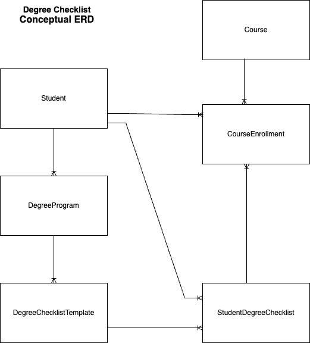
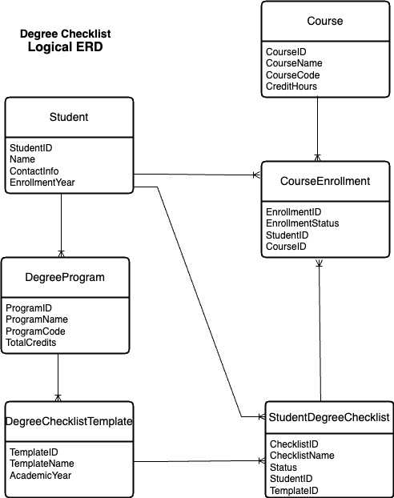
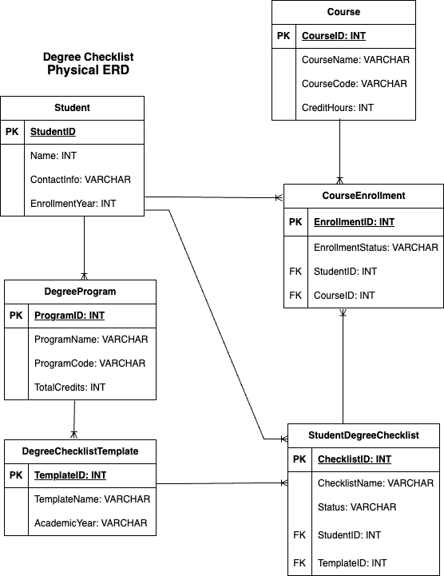

# ERD Diagrams for Degree Checklist

## Conceptual ERD

This ERD shows an overview of the primary entities and their relationships. The entities are: Student, DegreeProgram, Course, DegreeChecklistTemplate, StudentDegreeChecklist, and CourseEnrollment.
The Crow's foot notation indicates the relationships.

## Logical ERD

The logical ERD adds more detail to the conceptual ERD by adding attributes to the existing entities and relationships. This helps us focus on the structure of the data.

## Physical ERD

The physical ERD is the most detailed. It adds database-specific details such as keys, data types, and constraints. It represents the details in tables and columns and still shows relationships present in previous ERDs.

These ERDs provide an understanding of the data structure and relationships within the degree checklist system.

## NOTE: my all_records.html in the format below was not showing up in my browser when running the server, so I removed the tags/associated sections from my project (for crispy-forms): 
 <!-- Load the necessary tags -->

<!DOCTYPE html>
<html>

<head>
    <title>All Records</title>
    <!-- Include crispy-forms CSS -->
    <link rel="stylesheet" href="">
</head>

<body>
    <h1>All Records</h1>

    <h2>Data Import</h2>
    <form method="post" enctype="multipart/form-data">
        
        
        <button type="submit">Import Data</button>
    </form>

    <h2>Students</h2>
    <ul>
        
        <li>{{ student.Name|uppercase }} - {{ student.ContactInfo }} ({{ student.EnrollmentYear }})</li>
        
        <li>No students found.</li>
        
    </ul>

    <!-- Other sections for Degree Programs, Courses, etc. -->

    <!-- Use the custom template tag -->
    
Current time: {% current_time "%Y-%m-%d %H:%M:%S" %}

    <!-- Include crispy-forms JavaScript -->
    
</body>

</html>

## Deployment Steps (completed steps 1 thru 8, at which point Heroku required a payment card on file for further action). Here are the steps:
1. Installed Heroku CLI
2. Created a Heroku account
3. Login to Heroku
4. Installed required packages 
5. Created a Procfile
6. Configured Static Files
7. Commited Changes to Github
8. Created a Heroku App (completed steps 1 thru 8)
9. Set Environment Variables
10. Push to Heroku
11. Migrate Database
12. Open the App